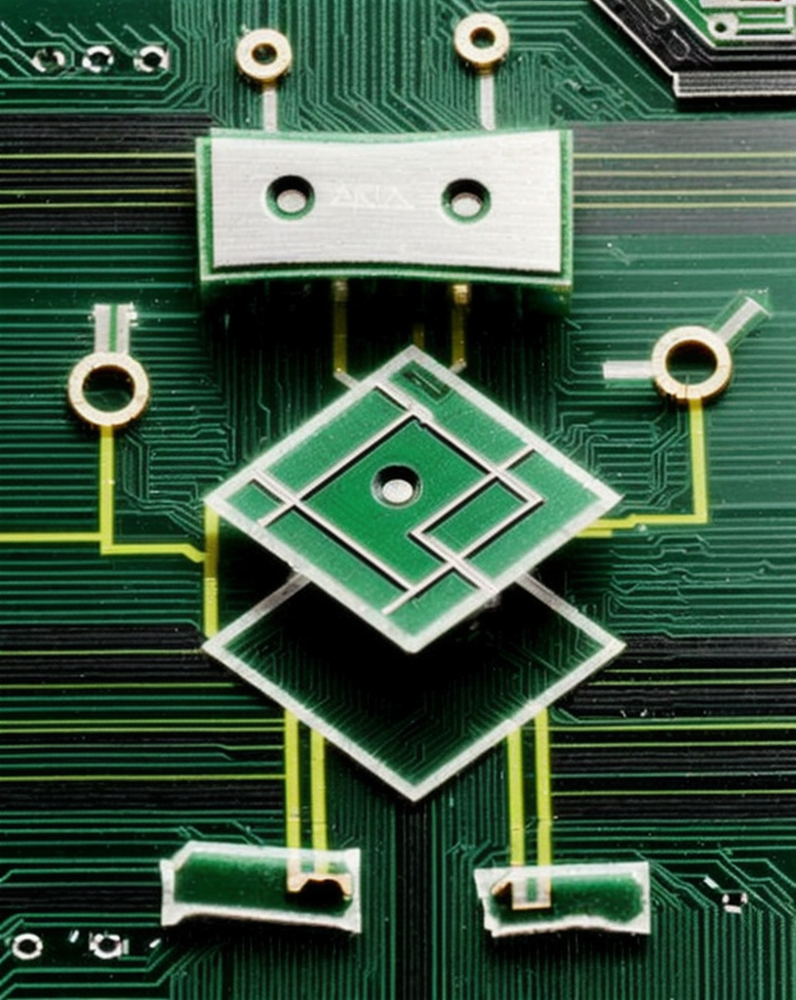

# Robo CNI configuration



Uses a large language model (LLM) to generate CNI configurations and net-attach-defs (like for [Multus CNI](https://github.com/k8snetworkplumbingwg/multus-cni)) from your "hints". using [ollama](https://github.com/jmorganca/ollama).

That is, it's an AI/ML 

I was initially get it to spin up pods ~95% of the time

# Usage

Clone this and build it with the `./hack/build-go.sh`.

Then, you can run `robocni` and give it a "hint" as to what kind of CNI configuration you'd like to generate.

```
export OLLAMA_HOST=192.168.50.199
./robocni "give me a macvlan CNI configuration mastered to eth0 using whereabouts ipam ranged on 192.0.2.0/24"
```

It generates net-attach-defs by default:

```
$ robocni --json "macvlan with whereabouts cni on 192.0.2.0/24"
{
    "cniVersion": "0.3.1",
    "name": "whereaboutsexample",
    "type": "macvlan",
    "master": "eth0",
    "mode": "bridge",
    "ipam": {
        "type": "whereabouts",
        "range": "192.0.2.0/24",
        "exclude": []
    }
}
```

# The "looprobocni" tool

This runs robocni in a loop and automatically creates the net-attach-defs using `kubectl` and then attaches pods to that network, makes a ping over them, and records the results.

Make sure `robocni` is in your path.

Put the hints in a `prompts.txt` file or pass the `--promptfile` parameter.

```
./looprobocni --runs 5000
```

Which would produce something like:

```
------------------ RUN # 12
User hint:  macvlan whereabouts 192.0.2.0/26
---
apiVersion: "k8s.cni.cncf.io/v1"
kind: NetworkAttachmentDefinition
metadata:
  name: whereaboutsexample
spec:
  config: '{
    "cniVersion": "0.3.1",
    "name": "whereaboutsexample",
    "type": "macvlan",
    "master": "eth0",
    "mode": "bridge",
    "ipam": {
        "type": "whereabouts",
        "range": "192.0.2.0/26"
    }
}'
Parsed name: whereaboutsexample
Spinning up pods...
Pod left is ready
Pod right is ready
IP Address for net1: 192.0.2.2
---
Run number: 12
Total Errors: 0 (0.00%)
Generation Errors: 0 (0.00%)
Failed Pod Creations: 0 (0.00%)
Ping Errors: 0 (0.00%)
Stats Array:
  Hint 1: Runs: 2, Successes: 2
  Hint 2: Runs: 1, Successes: 1
  Hint 3: Runs: 1, Successes: 1
  Hint 4: Runs: 3, Successes: 3
  Hint 5: Runs: 5, Successes: 5
  Hint 6: Runs: 0, Successes: 0
```

## Initial results

```
Run number: 5000
Total Errors: 481 (9.62%)
Generation Errors: 254 (5.08%)
Failed Pod Creations: 226 (4.52%)
Ping Errors: 0 (0.00%)
Stats Array:
  Hint 1: Runs: 786, Successes: 772
  Hint 2: Runs: 819, Successes: 763
  Hint 3: Runs: 777, Successes: 768
  Hint 4: Runs: 703, Successes: 685
  Hint 5: Runs: 879, Successes: 758
  Hint 6: Runs: 782, Successes: 773
```

Given these hints:

```
give me a macvlan CNI configuration mastered to eth0 using whereabouts ipam ranged on 192.0.2.0/24
an ipvlan configuration on eth0 with whereabouts for 10.40.0.15/27
type=macvlan master=eth0 whereabouts=10.30.0.0/24
ipvlan for eth0, ipam is whereabouts on 192.168.50.100/28 exclude 192.168.50.101/32
dude hook me up with a macvlan mastered to eth0 with whereabouts on a 10.10.0.0/16
macvlan eth0 whereabouts 10.40.0.0/24
```